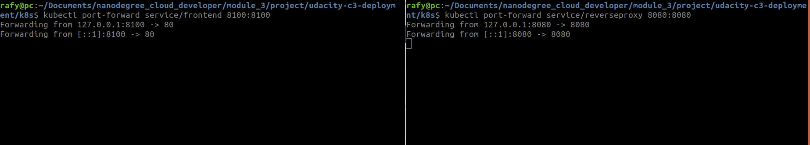

# Udagram Image Filtering Microservice

Udagram is a simple cloud application developed alongside the Udacity Cloud Engineering Nanodegree. It allows users to register and log into a web client, post photos to the feed, and process photos using an image filtering microservice.

## The motivation
1. Divide the application into smaller services
2. Containerize the application, create the Kubernetes resource, and deploy it to a Kubernetes cluster.
3. Implement automatic continuous integration (CI) and continuous delivery (CD) using Travis CI.
4. Extend the application with deployments and be able to do rolling-updates and rollbacksmicroservece


## Update Monolithic application to microservices

 ### Technologies 
 [Docker](https://docs.docker.com/docker-for-windows/install/)
 [AWS CLI](https://docs.aws.amazon.com/cli/latest/userguide/install-linux.html)
 [EKsctl](https://docs.aws.amazon.com/eks/latest/userguide/getting-started-eksctl.html)
 [kubectl](https://docs.aws.amazon.com/eks/latest/userguide/install-kubectl.html)

### Validate the installation


### Setup Environment Variables
#### Method 1 update your bash profile file 
open your bash profile then update it with environmental variables that will be used inside the application
```bash
vim ~/.profile
```
update it with below script
```bash
export POSTGRESS_USERNAME= postgress_username;
export POSTGRESS_PASSWORD= postgress_password;
export POSTGRESS_DB= postgress_database;
export POSTGRESS_HOST= postgress_host;
export AWS_REGION= aws_region;
export AWS_PROFILE= aws_profile;
export AWS_BUCKET= aws_bucket_name;
export JWT_SECRET= jwt_secret;
```
then source the file.
```bash 
source ~/.profile
```
#### Method 2 Create bash file
```bash
vim environment_variables.sh
```
update it with below script
```bash
export POSTGRESS_USERNAME= postgress_username;
export POSTGRESS_PASSWORD= postgress_password;
export POSTGRESS_DB= postgress_database;
export POSTGRESS_HOST= postgress_host;
export AWS_REGION= aws_region;
export AWS_PROFILE= aws_profile;
export AWS_BUCKET= aws_bucket_name;
export JWT_SECRET= jwt_secret;
```
then source the file.
```bash 
source ~/.profile
```
I prefer the second method as i don't mess with bash profiles

### Setup docker and build the images
go to `udacity-c3-deployment/docker` directory
```bash
docker-compose up
```
this command will build the images and create the containers


To check the running images 
```bash
docker images 
```


To check the running conatiners
``` bash 
docker ps 
```


### Push images to registry 
```bash
docker push docker_hub/image_name
```
example 
```bash 
docker push  rafyamgadbenjamin/udacity-restapi-feed
docker push  rafyamgadbenjamin/udacity-restapi-user
docker push  rafyamgadbenjamin/udacity-frontend:local
docker push  rafyamgadbenjamin/reverseproxy 
```
Check the the docker hub you have pushed the images to 


### Kubernetes
#### Create a Kubernetes Cluster on Amazon Cloud 
copy the following command


#### Configure configmaps and secrets to be used by Kubernetes
Encrypt your database username and password using base64
```bash
echo -n $POSTGRESS_PASSWORD | base64
echo -n $POSTGRESS_USERNAME | base64
```
then update `env-secret.yaml` file

Encrypt you aws file 
```
cat ~/.aws/credentials | base64
```
then update `aws-secret` file 
######note 
you have to concatenate the hashed values of `aws_access_key_id` then `aws_secret_access_key` in one line in the `aws-secret` file 

update the `env-configmap.yaml` file with your credentails to connect to `AWS RDS` service and `AWS S3 bucker` service correctly.

#### Setup kubernetes environment
go to `udacity-c3-deployment/k8s` directory

load secrets and apply all yaml files
```
kubectl apply -f aws-secret.yaml
kubectl apply -f env-secret.yaml
kubectl apply -f env-secret.yaml
kubectl apply -f .
```


##### List the pods 
```bash
kubectl get pods
```


##### List all 
```bash
kubectl get all
```


##### check the cluster on AWS


#### Connect the services and port forwarding
we will do port forwarding to the frontend service and reverse proxy service

###### Note
- you have to be sure that these ports are free `8100` and `8080`

```bash
kubectl port-forward service/frontend 8100:8100
kubectl port-forward service/reverseproxy 8080:8080
```


#### Extend the application with deployments and be able to do rolling-updates
I have updated the `cpu` value in `backend-feed-deployment.yaml` file 

applied the service 
```
kubectl apply -f backend-feed-deployment.yaml
```
check the status of the pods during applying this


### Apply CI/CD using TravisCl
- Connect [TravicCl](https://travis-ci.com/) to your `github`, signup, give it the required permissions and choose the repository that you will build.
- Add `.travis.yml` file in the root of your application and it must contains a valid `yaml`.

this is the configuration used for `TravisCl`
``` yaml
language: minimal

services: docker

env:
  - DOCKER_COMPOSE_VERSION=1.23.2

before_install:
  - docker -v && docker-compose -v
  - sudo rm /usr/local/bin/docker-compose
  - curl -L https://github.com/docker/compose/releases/download/${DOCKER_COMPOSE_VERSION}/docker-compose-`uname -s`-`uname -m` > docker-compose
  - chmod +x docker-compose
  - sudo mv docker-compose /usr/local/bin
  - curl -LO https://storage.googleapis.com/kubernetes-release/release/$(curl -s https://storage.googleapis.com/kubernetes-release/release/stable.txt)/bin/linux/amd64/kubectl
  - chmod +x ./kubectl
  - sudo mv ./kubectl /usr/local/bin/kubectl


install:
  - docker-compose -f udacity-c3-deployment/docker/docker-compose-build.yaml build --parallel 
```

From now and then every commit then push you do will trigger `TravisCl` to work.

- You can check the status of your build by visiting  [TravicCl](https://travis-ci.com/) and selecting your repository.


If everything worked correctly, you will be able to see your application working 


